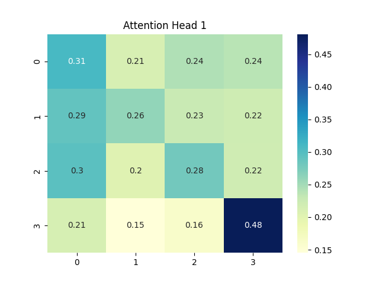

# ⚙️ Basit Transformer Encoder Uygulaması (NumPy ile)

Bu proje, **Transformer Encoder** bloğunun NumPy ile sıfırdan, sade bir şekilde nasıl uygulanabileceğini gösterir. Temel olarak **multi-head self-attention**, **layer normalization** ve **feed-forward ağlar** gibi bileşenleri içerir.

## 📌 İçerik

- Softmax ve Layer Normalization
- Multi-Head Self-Attention Mekanizması
- Basit Fully Connected Feed-Forward Katmanı
- Residual Connection + Layer Normalization
- Heatmap ile dikkat (attention) görselleştirmesi

## 🧠 Transformer Encoder Yapısı

Kod aşağıdaki işlem sırasını takip eder:

1. **Multi-Head Attention** uygulanır.
2. Elde edilen çıktılar giriş ile toplanıp **Layer Normalization** uygulanır.
3. **Feed-Forward Neural Network** uygulanır.
4. Tekrar residual + **Layer Normalization** yapılır.
5. Final çıktı ve attention ağırlıkları döndürülür.

## 📊 Görselleştirme

Aşağıda, bir attention head için dikkat ağırlık matrisi örneği gösterilmektedir:



## 🛠️ Kurulum

Aşağıdaki kütüphaneler gereklidir:

```bash
pip install numpy matplotlib seaborn
```
## 🔍 Notlar
Bu örnek eğitim amaçlıdır.

Büyük dil modellerindeki karmaşık yapılar sadeleştirilmiştir.

Kod, giriş olarak rastgele 4x8 boyutlu vektörler ile çalışır.

Gerçek modellerde ağırlık matrisleri öğrenilir; burada ise rastgele başlatılır.
